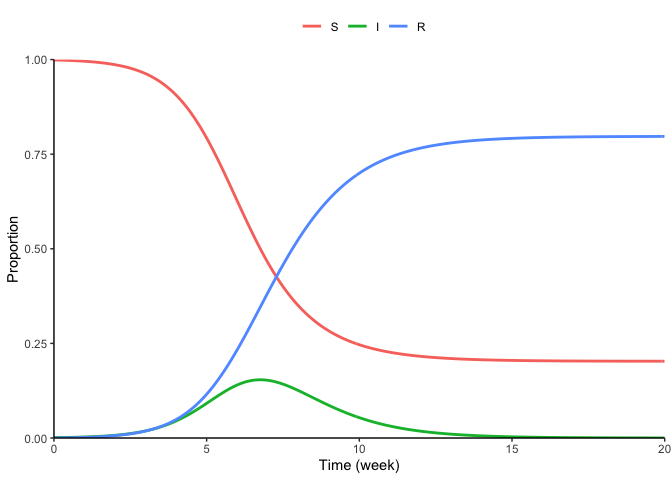
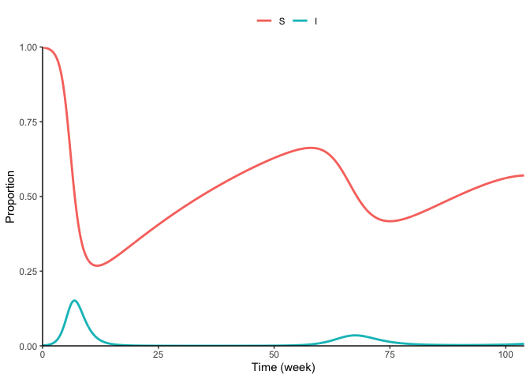
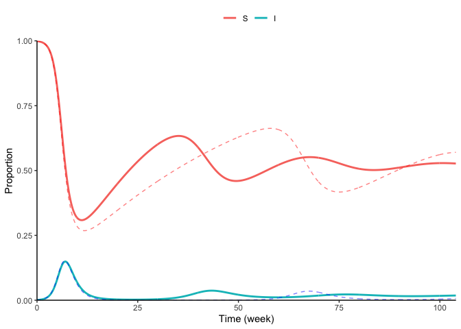
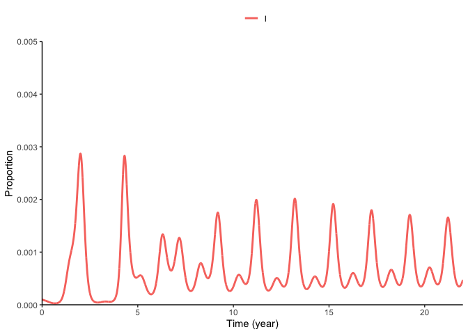

Plotting SIR models
================

Load package:

``` r
library(deSolve)
library(dplyr)
```

    ## 
    ## Attaching package: 'dplyr'

    ## The following objects are masked from 'package:stats':
    ## 
    ##     filter, lag

    ## The following objects are masked from 'package:base':
    ## 
    ##     intersect, setdiff, setequal, union

``` r
library(tidyr)
library(ggplot2)
library(SIRdiagrams)
```

SIR model:

``` r
out_SIR <- run_model()
plot_sim(out_SIR)
```

<!-- -->

SIR model with birth (no more R):

``` r
out_SIR2 <- run_model(parms=c(mu=1/52, beta=2, gamma=1),
                tvec=seq(0, 52*2, by=0.1))
plot_sim(out_SIR2, vars = c("S", "I"))
```

<!-- -->

SIR model with higher birth (no more R):

``` r
out_SIR3 <- run_model(parms=c(mu=1/52*2, beta=2, gamma=1),
                tvec=seq(0, 52*2, by=0.1))
plot_sim(out_SIR2, vars = c("S", "I")) 
```

<!-- -->

Overlay:

``` r
plot_sim(out_SIR3, vars = c("S", "I")) +
  geom_line(data=out_SIR2, aes(time, S), col="red", alpha=0.5, lty=2)  +
  geom_line(data=out_SIR2, aes(time, I), col="blue", alpha=0.5, lty=2)
```

<!-- -->

Seasonal SIR

``` r
out_SIR4 <- run_model(
  model=seasonalSIRmodel,
  parms=c(mu=1/52/50, beta0=17/2, theta=0.1, gamma=1/2),
  tvec=seq(0, 52*22, by=0.1),
  yini=c(S=0.05, I=1e-4, R=0))

plot_sim(out_SIR4, vars = c("I"), ylim=c(0, 0.005), deltat=52, tunit="(year)") 
```

<!-- -->
